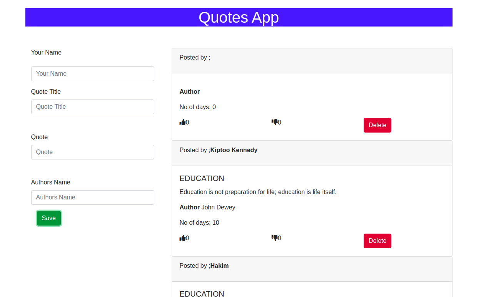

#   q  Quotes App
#### This project interlinks people who like quotes to create and to see other peoples quotes, 2020 
#### By **Kiptoo Kennedy;

## Description

This project was generated with [Angular CLI](https://github.com/angular/angular-cli) version 10.1.1

## Project live site
  This is the live Demo.
  

  ## Technologies Used
* Figma- For Design (https://www.figma.com/file/KachkJHgfxYshL5tPXjodW/Quotes-App?node-id=0%3A1)
* HTML-For Building Mark Up pages
* CSS-For styling User Interface
* Bootsrap-For making webpage responsive
* Angular 10;
* Typscript

## Behavior Driven Development
<table>
    <tr>
      <th>Behavior</th> 
      <th>Input</th> 
      <th>Output</th>   
    </tr>
    <tr>
        <td>on load</td>
        <td>scroll through </td>
        <td>reveals more quotes</td>
    </tr> 
    <tr>
        <td>On create quote enter details</td>
        <td>['KIPTOO']</td>
        <td>name = 'kENNEDY'</td>
    </tr>
    <tr>
        <td>Enter quote and the Author</td>
        <td>['Newton Law','gravity pulls down']</td>
        <td>Author and quote</td>
    </tr>
    <tr>
        <td>Save</td>
        <td>Details</td>
        <td>'Added to the quote list'</td>
    </tr>
       
</table>

## Development server

Run `ng serve` for a dev server. Navigate to `http://localhost:4200/`. The app will automatically reload if you change any of the source files.

## Code scaffolding

Run `ng generate component component-name` to generate a new component. You can also use `ng generate directive|pipe|service|class|guard|interface|enum|module`.

## Build

Run `ng build` to build the project. The build artifacts will be stored in the `dist/` directory. Use the `--prod` flag for a production build.

## Running unit tests

Run `ng test` to execute the unit tests via [Karma](https://karma-runner.github.io).

## Running end-to-end tests

Run `ng e2e` to execute the end-to-end tests via [Protractor](http://www.protractortest.org/).

## Support and contact details
contact me @ kiptoo097@gmailcom
### License
### [License](  https://kiptoo-097.github.io/Quotes-app/src/LICENSE.md)
Copyright &copy; 2020.All rigths reserved

## Further help

To get more help on the Angular CLI use `ng help` or go check out the [Angular CLI README](https://github.com/angular/angular-cli/blob/master/README.md).
